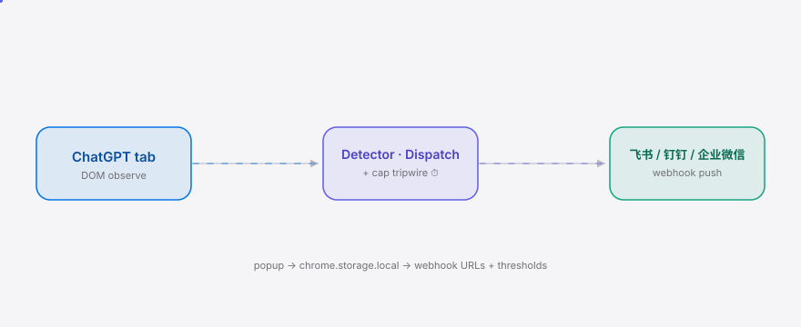
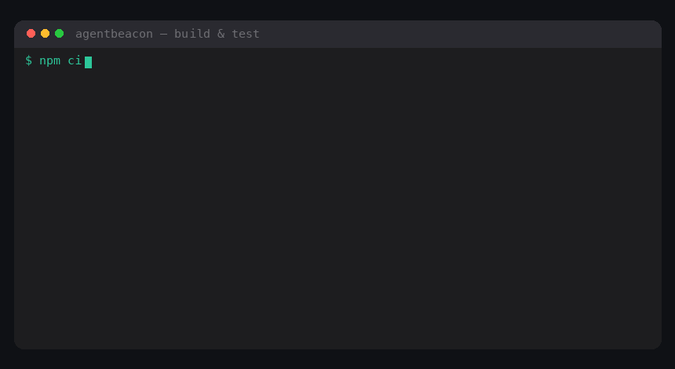

<div align="right"><sub><b>English</b>&nbsp;&nbsp;⇄&nbsp;&nbsp;<a href="./README.md">简体中文</a></sub></div>

<picture>
  <source media="(prefers-color-scheme: dark)" srcset="./assets/hero-dark.svg">
  <source media="(prefers-color-scheme: light)" srcset="./assets/hero-light.svg">
  
</picture>

<p align="center"><sub>Push your ChatGPT agent's completion + runaway-loop signals to 微信 / 钉钉 / 飞书, with a usage-cap tripwire.</sub></p>

<p align="center">
  <a href="./LICENSE"></a>
  <a href="https://github.com/SuperMarioYL/agentbeacon/releases"></a>
  
  
  
</p>

> **Stop an overnight Sol loop from burning your weekly cap.** An MV3 browser extension that observes the ChatGPT Sol / Deep Research DOM and pushes a signal to the IM you actually live in when the agent completes — or starts looping.

---

<h2> Contents</h2>

- [Why this exists](#why-this-exists)
- [Architecture](#architecture)
- [Install & quickstart](#install--quickstart)
- [Usage](#usage)
- [Demo](#demo)
- [Configuration](#configuration)
- [Roadmap](#roadmap)
- [License](#license)

<h2> Why this exists</h2>

Long-running cloud agents (ChatGPT Sol, Deep Research) give you no completion signal and no protection against runaway loops. The only move today is to keep a browser tab open and poll it by hand; the moment you sleep, a Sol that finished its task can keep looping for hours and burn the entire weekly usage cap to zero before anyone notices. The pain is verbatim from an r/ChatGPTPro post: "*It completed the task, then continually looped for hours until usage hit zero.*"

AgentBeacon's verb is **beacon**: detect that an agent has completed or has begun looping, and push that signal to the IM surface where you actually live. Completion → `✅ Agent completed`; runaway loop → `⚠️ Loop suspected — cap at risk`; cap exceeded → `⏱️ N min elapsed — cap at risk`.

**Why OpenAI won't ship this itself**: a usage-cap tripwire is incentive-misaligned (loop-burn is paid consumption), and no US vendor will natively integrate 微信/钉钉/飞书. That combination — DOM state → typed signal → CN-IM push + cap tripwire — is the structural moat.

<h2> Architecture</h2>

<picture>
  <source media="(prefers-color-scheme: dark)" srcset="./assets/atlas-dark.svg">
  <source media="(prefers-color-scheme: light)" srcset="./assets/atlas-light.svg">
  
</picture>

The core abstraction is an **AgentRunSignal** — a typed observation of a cloud-agent tab's DOM state, emitted by the content-script detector and consumed by the background dispatcher. It is not a new protocol; it is a typed event seam between "DOM-observable agent state" and "IM-push dispatch + cap tripwire."

```typescript
type AgentRunSignal =
  | { kind: "completed";     taskId: string; durationMin: number; summary: string }
  | { kind: "loop_suspected"; taskId: string; turnCount: number; idleMin: number; repeatedMsgHash?: string }
  | { kind: "cap_warning";    taskId: string; elapsedMin: number; thresholdMin: number }
```

Three logical components, **one process** (the browser), no backend: `content.ts` (MutationObserver → `detector.ts`) → `background.ts` (service worker + `chrome.alarms` tripwire + `webhook.ts` dispatch) → 飞书 / 钉钉 / 企业微信 bots. The channel builders (`feishu.ts` / `dingtalk.ts` / `wework.ts`) are pure functions — high cohesion per platform, narrow interface; DingTalk and Feishu sign with HMAC-SHA256, the WeCom group-robot authenticates via the `key` in its webhook URL.

<h2> Install & quickstart</h2>

```bash
git clone https://github.com/SuperMarioYL/agentbeacon && cd agentbeacon
npm install && npm run build        # emits dist/, ready to load-unpacked
```

1. Open `chrome://extensions` → enable **Developer mode** → **Load unpacked** → select the `dist/` directory.
2. Click the AgentBeacon toolbar icon → paste a 飞书 / 钉钉 / 企业微信 webhook URL → tick **启用** → **保存** → **发送测试 ping**. Receiving the test message in IM means the config is correct.
3. Open chatgpt.com, start a Sol / Deep Research task, and walk away. You will get an IM ping on completion.

<details><summary>Sample build output</summary>

```
 ✓ 17 modules transformed.
 dist/manifest.json           1.30 kB
 dist/service-worker-loader.js  0.04 kB
 dist/assets/background.ts-BZT1wa6g.js   1.67 kB
 dist/assets/popup.html-Ir_kWul8.js      2.35 kB
 ✓ built in 37ms
 Test Files  8 passed (8)
      Tests  35 passed (35)
```

</details>

<h2> Usage</h2>

### Three signals

| Signal | Trigger | IM text |
|---|---|---|
| `completed` | streaming → idle transition with a final turn present ("the agent finished a turn") | `✅ Agent completed (N min). <summary>` |
| `loop_suspected` | a ≥60-char assistant message repeats across turns (past the turn-count floor) | `⚠️ Loop suspected — cap at risk. Turns: N, idle M min · repeated msg <hash>` |
| `cap_warning` | run still active past the usage threshold (`chrome.alarms` timer) | `⏱️ N min elapsed — cap at risk (threshold M min).` |

> Loop detection is **best-effort** and labeled as such: server-side action repetition is not visible from the browser DOM, so the heuristic keys on a repeated *substantial* message across turns. Long silent non-terminating runs are caught by the **cap tripwire** (time-based), not by loop detection.

### The three IM platforms

```typescript
// Feishu: body carries timestamp (seconds) + sign = base64(HMAC-SHA256(key=`ts\nsecret`, msg=""))
// DingTalk: URL carries timestamp (ms) + sign = base64(HMAC-SHA256(key=secret, msg=`ts\nsecret`)), URL-encoded
// WeCom: the key in the webhook URL is the credential; no extra signature
```

Each channel builder is a pure function with an injectable fetch — see `src/lib/channels/`. The full happy path is in [`examples/quickstart.md`](./examples/quickstart.md).

<h2> Demo</h2>



The terminal happy path (`npm ci → npm test → npm run build`). The browser-side "install → Sol run → 飞书 ping" flow is steps 1–3 of [`BUILD_SETUP_NEXT_STEPS.md`](./BUILD_SETUP_NEXT_STEPS.md). `docs/demo.tape` is the vhs script; the `demo.yml` workflow re-renders the gif on demand.

<h2> Configuration</h2>

Config lives in `chrome.storage.local` under key `agentbeacon.config.v1`, read/written by the popup. Defaults are in `DEFAULT_CONFIG` in `src/lib/store.ts`.

| Key | Type | Default | Meaning |
|---|---|---|---|
| `feishu` / `dingtalk` / `wework` | `{ webhookUrl, secret?, enabled }` | empty / off | per-channel webhook URL, signing secret, enable toggle |
| `capThresholdMin` | number | `240` | minutes after run start before a cap warning fires |
| `loopThresholdMin` | number | `5` | idle minutes reported in the loop alert (context) |
| `loopTurnDelta` | number | `3` | minimum total turns before a loop is flagged (false-positive floor) |

<h2> Roadmap</h2>

- [x] **m1 — observe agent**: content-script MutationObserver detects completion, dispatches to 飞书.
- [x] **m2 — route channels**: 钉钉 + 企业微信 + popup config + `chrome.alarms` cap tripwire.
- [x] **m3 — detect loop**: repeated-substantial-message heuristic + best-effort labeling + demo + README.
- [ ] **v0.2 — hosted relay**: a Cloudflare Worker + D1 that holds the cap timer server-side and pings IM even when the browser is closed (~$5/mo tier; build only after ≥10 waitlist signups confirm the browser-closed pain is real).
- [ ] **v0.2 — Chrome Web Store listing** (currently load-unpacked only, to avoid review blocking the launch).
- [ ] **v0.3+**: Codex CLI process wrapping, global IM (Slack/Discord/Telegram), multi-user/team dashboard.

<h2> License</h2>

MIT — see [LICENSE](./LICENSE). Issues and PRs welcome.
