**English** | [简体中文](README.md)

<picture>
  <source media="(max-width: 640px) and (prefers-color-scheme: dark)" srcset="assets/presentation/hero-mobile-dark.svg">
  <source media="(max-width: 640px)" srcset="assets/presentation/hero-mobile-light.svg">
  <source media="(prefers-color-scheme: dark)" srcset="assets/presentation/hero-dark.svg">
  
</picture>

**Observe completion and repeated-message signals in a ChatGPT tab and route alerts through configured IM webhooks.**

`v0.1.0` · `Node.js 22+; Bun for demo` · [MIT](LICENSE)

[Website](https://agentbeacon.lei6393.com) · [Demo record](docs/demo-results.json)

## Why use it

Repeatedly opening a long-running task just to check its status interrupts other work. AgentBeacon observes browser-side changes and turns a completed turn, suspicious repetition or elapsed-time threshold into a routable event. Alerts still require an enabled extension and a working webhook.

## Architecture

<picture>
  <source media="(max-width: 640px) and (prefers-color-scheme: dark)" srcset="assets/presentation/architecture-mobile-dark.svg">
  <source media="(max-width: 640px)" srcset="assets/presentation/architecture-mobile-light.svg">
  <source media="(prefers-color-scheme: dark)" srcset="assets/presentation/architecture-dark.svg">
  
</picture>

content.ts samples the page through MutationObserver. detector.ts emits AgentRunSignal values; background.ts manages chrome.alarms and dispatch. Channel modules build Feishu, DingTalk and WeCom requests, with configuration in chrome.storage.local.

See [detector.ts](src/lib/detector.ts) for classification and [store.ts](src/lib/store.ts) for defaults. completed means an observed streaming-to-idle turn transition, not proof of overall task success.

## Install

The extension build requires Node.js 22+. The offline TypeScript demo below uses Bun. After building, load dist/ manually through chrome://extensions.

```bash
git clone https://github.com/SuperMarioYL/agentbeacon.git
cd agentbeacon
npm ci
npm run build
```

## Quickstart

The demo runs the real Detector on fixed synthetic observations and emits completed and loop_suspected. It does not read a live ChatGPT page, send IM messages or inspect account usage.

```bash
bun examples/presentation_demo.ts completed
bun examples/presentation_demo.ts loop
```

The complete observations and state transitions are in [examples/presentation_demo.ts](examples/presentation_demo.ts).

## Usage

After loading the extension, configure webhook URLs, optional secrets and enable switches in the popup. Completion fires once per Detector lifecycle. A loop signal requires the turn-count floor and repetition of a message at least 60 characters long. Validate current DOM compatibility in your own browser and test channel.

## Recorded demo

<picture>
  <source media="(max-width: 640px) and (prefers-color-scheme: dark)" srcset="assets/presentation/process-mobile-dark.svg">
  <source media="(max-width: 640px)" srcset="assets/presentation/process-mobile-light.svg">
  <source media="(prefers-color-scheme: dark)" srcset="assets/presentation/process-dark.svg">
  
</picture>

### Completion transition

A fixed one-minute transition emits completed.

```text
$ bun examples/presentation_demo.ts completed
[
  {
    "kind": "completed",
    "taskId": "demo-task",
    "durationMin": 1,
    "summary": "The example is complete."
  }
]
```

### Repeated message

Repeating a substantial message across three turns emits loop_suspected.

```text
$ bun examples/presentation_demo.ts loop
[
  {
    "kind": "loop_suspected",
    "taskId": "demo-task",
    "turnCount": 3,
    "idleMin": 0,
    "repeatedMsgHash": "c4b2ce0"
  }
]
```

## Capabilities and integration

<picture>
  <source media="(max-width: 640px) and (prefers-color-scheme: dark)" srcset="assets/presentation/integrations-mobile-dark.svg">
  <source media="(max-width: 640px)" srcset="assets/presentation/integrations-mobile-light.svg">
  <source media="(prefers-color-scheme: dark)" srcset="assets/presentation/integrations-dark.svg">
  
</picture>

Observation and classification run locally in the browser; notifications use user-configured webhooks. The pure-logic demo covers the classifier only. Channel delivery requires separate validation with real configuration.


## Configuration

Defaults are capThresholdMin=240, loopTurnDelta=3 and loopThresholdMin=5; all channels start disabled. Configuration uses agentbeacon.config.v1. cap_warning is an elapsed-time alert: it does not read actual usage, stop the server-side task or enforce an account quota.

## Roadmap and scope

The MV3 extension, three signal types, three webhook routes and local configuration are implemented. Hosted relay, store distribution, process integrations and team features remain future work; no server continues monitoring after the browser closes.

- DOM selectors depend on page structure; this offline demo does not validate the current live page.
- Repeated text is a heuristic signal, not proof of a server-side action loop.
- The extension does not read actual usage or enforce a hard quota.

[Terminal recording](assets/demo.gif) · [Recording script](docs/demo.tape)

## License

[MIT](LICENSE)
